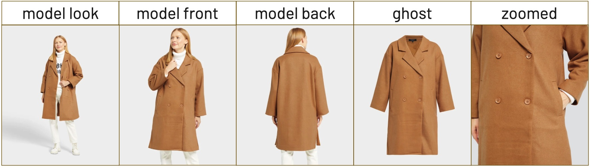
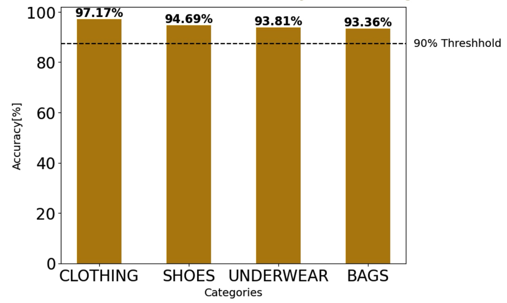
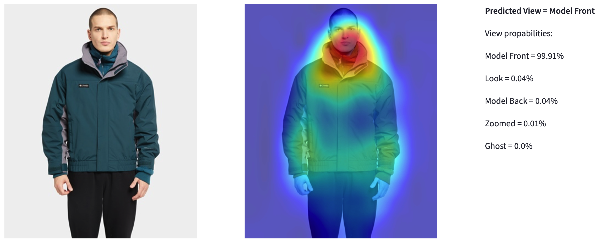

# BestSecret Image Classification Project 

This repository contains complete Propulsion Academy students' final project on BestSecret's Image Classification Project using baseline CNN models and Transfer Learning from popular pre-built models such as ResNet50, EfficientNetB0 and InceptionNet-V3. 

## Authors

[Faezeh Nejati Hatamian](https://www.linkedin.com/in/faezeh-nejati-hatamian/),  [Tschimegma Bataa](https://www.linkedin.com/in/tschimegma-bataa-47126146/), [Anurag Chowdhury](https://www.linkedin.com/in/anurag-chowdhury-8752377/)

## Supervisors

[Adriano Persegani](https://www.linkedin.com/in/adriano-persegani/), [Ekaterina Butyugina](https://www.linkedin.com/in/ekaterina-butyugina/) 

## Purpose 

BestSecret is an online fashion retail brand (https://www.bestsecret.com/entrance/index.htm). For each product categor their vendors upload 5 types of image views - Front, Back, Look, Zoom (for Bags product this would be Side view) and Ghost (for Bags product this would be Inside view). Vendors often tag the image views incorrectly and this causes the labeling of the image views on the website to be incorrect. Anecdotally, the error rate is approximately 10%.
The goal of the project is to come up with an image view classification model for 4 product categories - Clothes, Bags, Schuhe, and Waesche.

Here is an example of the 5 different image views for the clothes product category:

## Data 

The raw image data for each of the 4 product categories and 5 image views were provided by the BestSecret team and is stored in the Google Drive - https://drive.google.com/drive/folders/1Dw7Ae8--BC0I5ROvg36sZB9nZSsGQnyv

## Requirements

The [Environment](environment.yml)
 file contains all the necessary python packages.  

## How to work with this repo

### Part 1. Processing the data

The python notebook - ./notebooks/Image_Dataset_Prep.ipynb has the code that download the raw images provided to us by the BestSecret team from the Google Drive - https://drive.google.com/drive/folders/1Dw7Ae8--BC0I5ROvg36sZB9nZSsGQnyv and creates tensor datasets that are split into Training, Validation and Test datasets. The notebook was run within the Google Colab environment. These tensor datasets that are created are moved from the Colab environment to Google Drive so it can be used later directly in training models (instead of processing the raw images again from scratch). This makes it much faster to execute in the future.

### Part 2. Training the Image Classification Deep Learning models

We tried several different image classification models starting from crateing our own baseline CNN model to transfer learning from industry leading pre-trained popular models such as ResNet50, EfficientNetB0 and InceptionNet-V3. 

The following python notebooks have the code used to train, validate and test our models -

**Train_Val_Test_BaselineCNN_Model.ipynb** - this is the notebook used to build our own baseline CNN model that is trained on BestSecret images

**Train_Val_Test_ResNet50_Model.ipynb** - this is the notebook used to build our transfer learning ResNet50 model that is finetuned on BestSecret images

### Part 3. Results

The best models we got were the RestNet50 transfer learbing models across all product categories.
Here are the results:

Here is a sample prediction:

## Steps to setup the Best Secretlit Stream App

**Step 1**

**First Setup your enviroment in your local machine and install all the relevant packages**

conda create --name best_secret

conda activate best_secret

conda install python=3.10.12

conda install matplotlib

conda install tensorflow

conda install conda-forge::streamlit -y

conda install -c conda-forge opencv

**Step 2**

**In your command line terminal go to the root folder where you want to save the streamlit Git project**

cd root_folder_path

**Clone the project from Git**

git clone git@github.com:anurag-chowdhury1975/BestSecretApp.git

Once the cloning is complete you should see the following directory structure created:

* bestsecret
    * notebooks
    * src

**Step 3**

**The datasets and models have not been added to the GitHub project because of privacy issues. You will need to first create the following folders before downloading the datasets and models to your local drive from Best Secrets Google Drive folder:**

cd bestsecret

mkdir data

mkdir models

After this your project folder structure should look like this:

* BestSecretApp
    * data
    * models
    * notebooks
    * src

**Step 4**

**Download ONLY the test datasets for each product category from Best Secrets Google Drive folder https://drive.google.com/drive/folders/1_difVXO-_N1iMFzxMP2IFeD7e8tUhRBV, to your local project folder.**

Your local project folder structure should look like this after you download the test datasets:
* BestSecretApp
    * data
        * bag
            * test_dataset
        * clothes
            * test_dataset
        * schuhe
            * test_dataset
        * waesche
            * test_dataset

**Step 5**

**Next you need to download the latest best models for each product from the GoogleDrive folder https://drive.google.com/drive/folders/1JUgLVKtQinZkC79GIsnu6YwbAESWpntX, into your local project folder**

Your local project folder structure should look like this after you download the models:

(NOTE: the model file names listed below are the best models we have as of 14/02/2024, if we get better models later you need to add these to the local project as well):
* BestSecretApp
    * models
        * bag_resnet50_model_ft_all_93%.h5
        * clothes_resnet50_func_model_97%.h5
        * models/schuhe_resnet50_model_ft_all_94%.h5
        * models/waesch_funcResnet_model_94%.h5

**Step 6**

**You should be all set to run the BestSecret streamlit app from your local machine now using the following command:**

(NOTE: make sure you are in the BestSecretApp folder before you run the command below.)

streamlit run src/bestsecret_app.py

# Helpful Links
-  Bestsecret Drive: https://drive.google.com/drive/folders/1e-1L27rbWjGCf1nRA28dKqjSC94_cL36
-  https://medium.com/nanonets/how-to-classify-fashion-images-easily-using-convnets-81e1e0019ffe
-  https://towardsdatascience.com/fashion-product-image-classification-using-neural-networks-machine-learning-from-scratch-part-e9fda9e47661
-  A Novel Method for Fashion Clothing Image Classification Based on Deep Learning: https://e-journal.uum.edu.my/index.php/jict/article/view/18162/3856
-  Image Classification Using Multiple Convolutional Neural Networks on the Fashion-MNIST Dataset: https://www.ncbi.nlm.nih.gov/pmc/articles/PMC9739239/
-  https://www.kaggle.com/models/keras/yolov8
-  https://blog.roboflow.com/how-to-train-yolov5-on-a-custom-dataset/
- https://karpathy.github.io/2019/04/25/recipe/#2-set-up-the-end-to-end-trainingevaluation-skeleton--get-dumb-baselines
- https://www.tensorflow.org/tutorials/images/cnn
- https://www.tensorflow.org/tutorials/keras/classification

